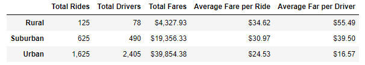

# PyBer_Analysis

## Overview
The purpose of this assignment was to process ride & city data with the end goal is to help to improve PyBer ride sharing services. The analysis leverages Python, Jupyter notebooks and visualizations to reveal the stories contained within the data.
The summary DataFrame reveals that Rural areas have far fewer rides, drivers and therefore the total fare income is much lower as well. However, the average fare per ride is the highest in Rural areas matched with a significantly higher fare per driver. This may indicate that as ride occur in less urban areas, the longer the rides are.
It is difficult to glean conclusions just from the line graph. From a visual glance there are similarities between each of the city types. For example, there is a clear spike in each city type during the 3rd week of February.

## Challenges
The initial challenge is to first combine the provided datasets then appropriately “slice” the data for the creation of a variety of charts and tables. To avoid confusion of rework an analyst should first clearly determine their objectives (i.e. know they need a scatter chart based of “x”). This should be followed by “sketching” a rough outline of the steps needed in a pseudocode like fashion
A key, but nuanced, hurdle was ensuring the use of the copy() function so that a true copy of an important dataframe was created and not just a pointer to a prior one. Additionally, knowing when to change dataframe indices and learning new functions like resample were essential 

## Recommendations
Based on the data from the different city types, what recommendations would you give the CEO for addressing any disparities among the city types?
Provide two additional analyses you could do to gain more insight into the data, like using other datasets.
What technical steps would you take to perform the additional analyses?

Recommendations
Rural areas seem to have a relatively low number of drivers. An evaluation should be done to determine if the community has ready access to services or if there are significant delays. With the high number of rides in urban areas it may be worthwhile researching frequent rider programs.

Potential additional analyses:
- Ride length
- Analyzing data on airport rides
- Ride information by account (researching repeate riders)
- Attendance at events that happened across the areas could help understand the spikes on the line graph